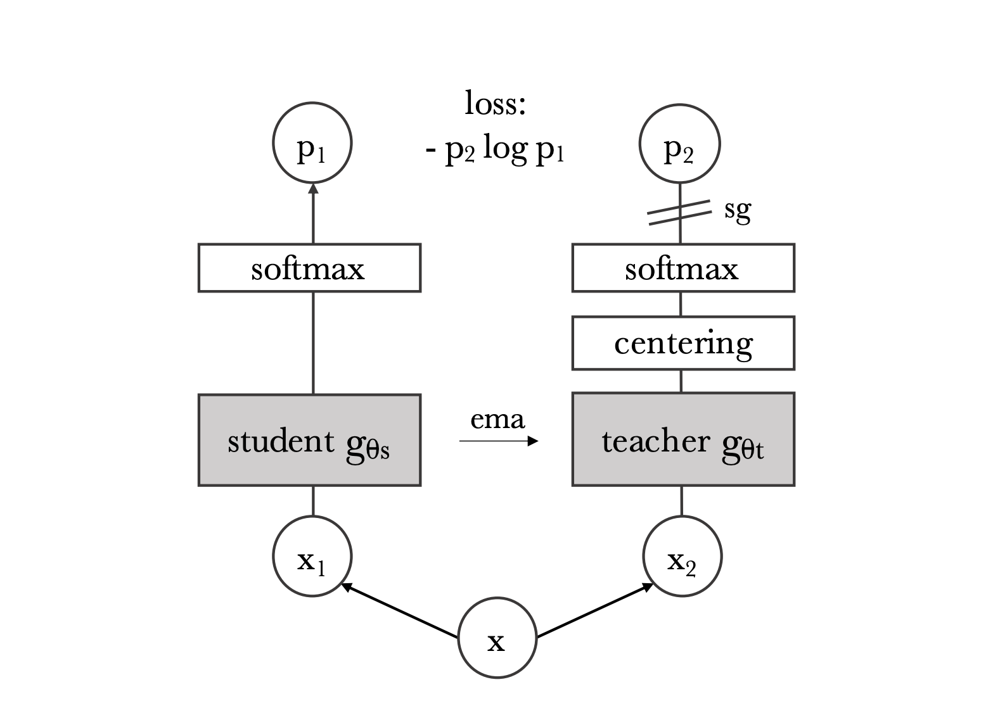

# DINO: Self-distillation with no labels 🦕

<p align="center">
    
</p>

**Source**: [*Emerging Properties in Self-Supervised Vision Transformers*](https://arxiv.org/abs/2104.14294).

## Overview
This repository implements DINO (self-distillation without labels) using PyTorch Lightning.

This repository is part of my broader goal to implement DINOv2 for building foundation-level vision models without the need for labels.

### Supported Tasks
- **Self-supervised Pre-training**: Supports pre-training on the [ImageNet-1k dataset](https://huggingface.co/datasets/ILSVRC/imagenet-1k), available on Hugging Face.  
- **Fine-tuning**: For **ImageNet-1k**, **CIFAR-10**, and **CIFAR-100**.  
- **Attention Visualization**: Multi-head attention visualization on images.

## Linear Probing Results
| Dataset        | Loss   | Accuracy   |
|----------------|--------|------------|
| CIFAR-10       | 0.2640 | **90.09%** |
| CIFAR-100      | 0.8897 | **74.34%** |

## Multi-Head Attention Visualization

<p align="center">
    
</p>
<p align="center">
    
</p>
<p align="center">
    
</p>
<p align="center">
    
</p>

<p align="center">
    
</p>


## Installation
```bash
pip install -r requirements.txt
```

## ImageNet Download
To download ImageNet-1k before pre-training, create a `.env` file using .env.example as a template and enter your HuggingFace token.

```dotenv
HF_TOKEN=YOUR_HF_TOKEN
```
Once completed, enter the `src` directory and run:

```bash
python get_imagenet.py
```

## Pre-train Configuration
Configure pre-training through `pre-train.yaml` found under the `src/configs` directory. The configuration used in my experiments is shown below:

```yaml
# network
backbone: vit-s-16
mlp_layers: 3
hidden_dim: 2048
bottleneck_dim: 256
k_dim: 65536

# ema teacher momentum
base_teacher_momentum: 0.996
final_teacher_momentum: 1.000

# weight decay
base_weight_decay: 0.04
final_weight_decay: 0.4

# learning rate
warmup_epochs_lr: 10
warmup_start_lr: 0.0
final_lr: 1.0e-6

# temperatures
student_temp: 0.1
warmup_teacher_epochs: 0
warmup_teacher_temp: 0.04
final_teacher_temp: 0.04

# cropping
global_scale_min: 0.4
global_scale_max: 1.0
local_scale_min: 0.05
local_scale_max: 0.4
num_local_crops: 10

# others
batch_size: 1024
center_momentum: 0.9
seed: 42
epochs: 100
experiment_num: 0
```

## Finetune Configuration
Configure the finetuning script through `finetune.yaml` which is also found under the `src/configs` directory. The configuration used in my experiments is shown below:

```yaml
backbone: vit-s-16

seed: 42
epochs: 100
lr: 1.0e-4
eta_min: 1.0e-6
batch_size: 8
weight_decay: 1.0e-5
experiment_num: 0
dataset: cifar-10
```

## Training
To pre-train and finetune the encoders, run the following from within the `src` directory:

```bash
# self-supervised pre-training
python pre_train.py
```

```bash
# finetuning
python finetune.py
```

## Embedding Visualization

### CIFAR-10 pre-trained with DINO

<p align="center">
    
</p>

### To-Do
- [x] Implement DINO for self-supervised learning.
- [x] Embedding visualization.
- [x] Linear probe evaluation for CIFAR datasets.
- [ ] Linear probe evaluation for ImageNet dataset.
- [ ] Sync BatchNorm for Multi-GPU ResNet-50 pre-training.
- [ ] KNN evaluation on CIFAR datasets.
- [ ] KNN evaluation on ImageNet dataset.
